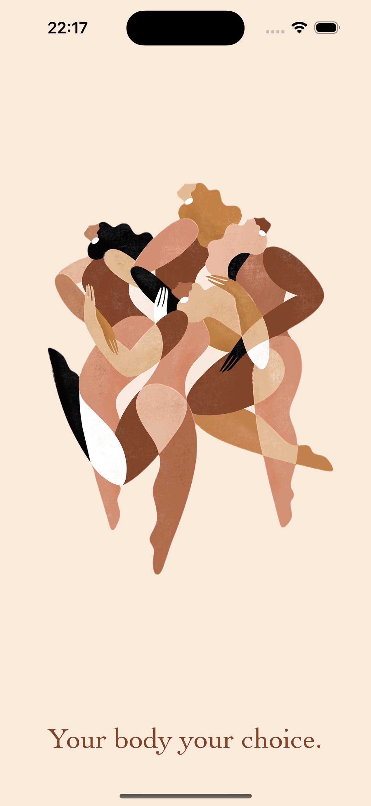
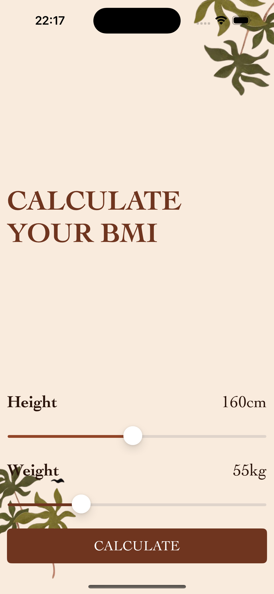
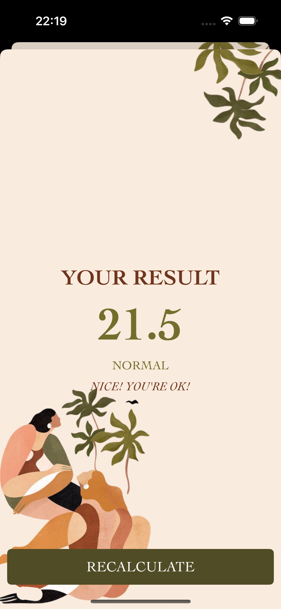

# BMI Calculator

This is a Body Mass Index calculator. Based on the user’s weight and height it will calculate their body mass and give a piece of health advice depending on whether if they have eaten too many pies or if they need to eat more pies.

##About the project 
The project has been created by using Swift, Storyboard, Auto Layout, MVC pattern. It has two screens.

## Screens

### Launch Screen

  

### Calculate Screen

  

### Result Screen

  
